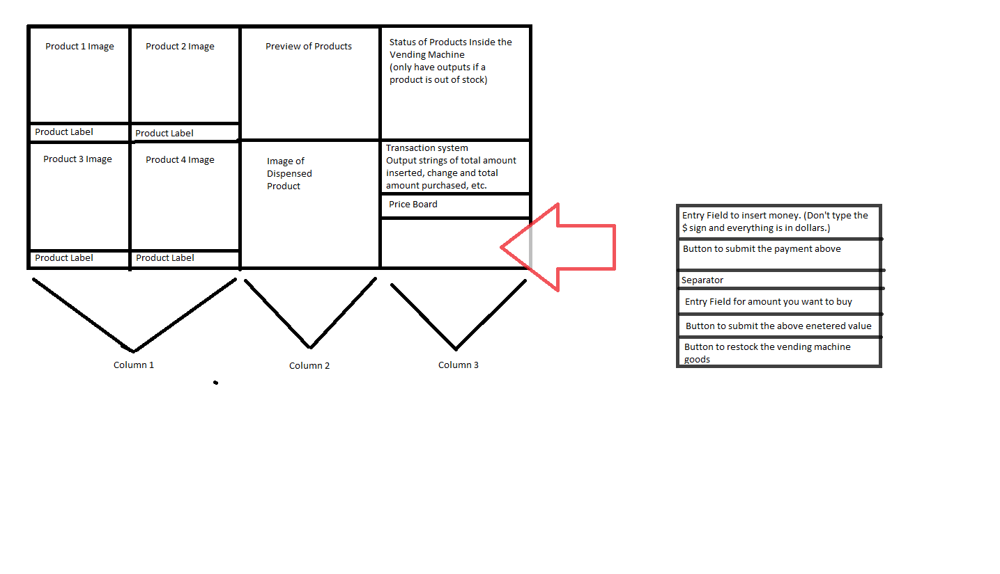
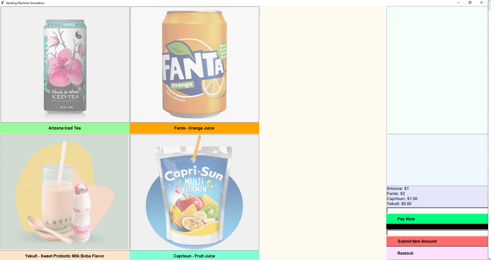

# Vending Machine Simulation 
Resideo Coding Exercise March 2021 by Aaron Chen

## Thought and Design Process
<p>
    This project was done for the coding exercise given by Eric Oh. The exercise was to allow a GUI screen to show a customer 4 different product selections. Each product has a different cost and the customer can purchase any amount. I originally planned on using Django to create the front-end and the back-end. However, I decide that it will be much simpler to just stick with Tkinter because of the simplicity of their grid system and widgets. 
</p>



<p>
    Shown above is the design layout that I came out for this vending machine simulation. I thought of the entire rectangle as one large frame, where it will then be split into three columns. The left column will hold the images and labels for each product. There will be a mini frame for each product. The top frame of the middle column will allow us to preview the product when we hover over its label. The bottom frame of the middle column will display an image of the product that was just purchased. The right column will display messages on the availability of the products in the vending machine, display records of transaction (money inserted, number of products purchased, change), display price board, and allow customers to insert money and choose the number of product they want to purchase. Last but not least, the restock button is at the very bottom of this right hand column. 
</p>

<p>
    Note to keep in mind: When we display the image of the product that was just purchased, it shows up in the top frame of the middle column. This is due to the way the grid system and widgets work in Tkinter. When we are no longer hovering over the product label, there will no longer be a preview. As a result, the size of the top frame will collapse to basically one line. Thus, when the image of the product purchased is displayed, it'll basically be displayed on the first line + size of bottom half frame.
</p>

## Running the Code
This python file uses several Python libraries such as Pillow and pygame. First, download these requirements:
```
pip install Pillow
pip install pygame
```

Once you're done downloading these libraries, just run the sim.py file on Visual Studio Code. Enjoy!

## Final Product

<p>
    This is the display right when the python file is run. Note that the middle column is empty because there's nothing to display yet. Also note that the status box and transaction system on the right hand column is also empty due to the same reason.
</p>